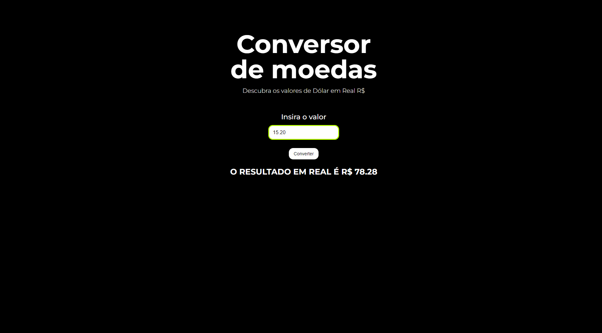

# Conversor de Moedas

> Imersão Dev

Projeto construído no evento Imersão Dev da Alura.

[🔗 Clique aqui para acessar](https://guylhermed.github.io/conversor-de-moedas/)

## 🛠 Tecnologias

- HTML
- CSS
- JavaScript
- Git e Github

## ✉ Contato

guylherme_duarte@hotmail.com
